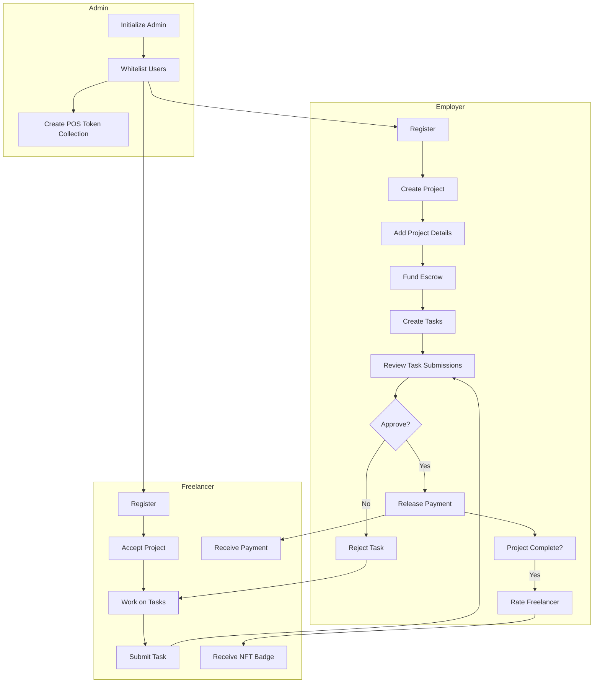

# Capstone

## Project Title: TaskPay

A blockchain-based marketplace built on Solana that fosters trust and transparency between freelancers and employers.

## Overview

This platform addresses common pain points in the freelance industry:

- **For Freelancers**: Delayed payments, scope creep, and lack of recognition for completed work
- **For Employers**: Difficulty tracking project progress, ensuring deadlines are met, and maintaining transparency

By leveraging blockchain technology, this marketplace provides a secure and transparent environment for both parties to collaborate efficiently.

## Core Features

### 1. On-Chain Task Tracking

Every project and its associated tasks are recorded immutably on the blockchain. This ensures transparent progress tracking and clearly defined scope, minimizing disputes and ensuring accountability.

### 2. Secure Payment Escrow

When a project begins, the employer deposits the agreed-upon amount into a secure escrow vault. Payments are automatically released as tasks are completed and approved, ensuring:

- Freelancers are paid fairly and promptly
- Employers retain control over quality
- Payments are directly tied to deliverables

### 3. Proof of Skill Badges (NFTs)

Upon project completion, freelancers receive NFT badges that serve as verifiable proof of their skills and accomplishments. These badges:

- Can be shared with future employers
- Give freelancers a competitive edge
- Offer employers a transparent way to assess potential hires

## Technical Architecture

The platform is built on Solana using the Anchor framework, chosen for its high throughput, low transaction costs, and robust smart contract capabilities.

### System Components

```
┌─────────────────────┐     ┌─────────────────────┐
│     Admin Module    │     │   Whitelist System  │
├─────────────────────┤     ├─────────────────────┤
│ - Initialize admin  │     │ - Whitelist         │
│ - Create POS tokens │     │   freelancers       │
│ - Manage users      │     │ - Whitelist         │
└─────────────────────┘     │   employers         │
                            └─────────────────────┘
            │                         │
            └─────────────┬──────────┘
                          ▼
┌─────────────────────────────────────────────────┐
│               Project Management                │
├─────────────────────────────────────────────────┤
│ - Initialize projects                           │
│ - Add project details                           │
│ - Create tasks                                  │
│ - Project acceptance by freelancers             │
└─────────────────────────┬───────────────────────┘
                          │
         ┌────────────────┼────────────────┐
         │                │                │
         ▼                ▼                ▼
┌─────────────────┐ ┌────────────┐ ┌─────────────────┐
│  Task Workflow  │ │   Escrow   │ │  Rating System  │
├─────────────────┤ ├────────────┤ ├─────────────────┤
│ - Submit tasks  │ │ - Secure   │ │ - Rate          │
│ - Review tasks  │ │   payments │ │   freelancers   │
│ - Task approval │ │ - Release  │ │ - Maintain      │
│   or rejection  │ │   funds    │ │   reputation    │
└─────────────────┘ └────────────┘ └─────────────────┘
                          │
                          ▼
                ┌──────────────────────┐
                │  NFT Badge System    │
                ├──────────────────────┤
                │ - Create POS tokens  │
                │ - Mint skill badges  │
                │ - Verify experience  │
                └──────────────────────┘
```

## Detailed Process Flow



## User Flow

### Employer Flow

1. **Registration**: Employer registers and gets whitelisted by the admin
2. **Project Creation**: 
   - Create a new project with title and budget
   - Add project details (description, requirements, deadline)
   - Deposit funds into escrow vault
   - Create tasks with individual budgets and descriptions
3. **Project Management**:
   - Review task submissions
   - Approve completed tasks (triggers automatic payment)
   - Rate freelancer upon project completion

### Freelancer Flow

1. **Registration**: Freelancer registers and gets whitelisted by the admin
2. **Project Acceptance**:
   - Browse open projects matching their profession
   - Accept a project to begin work
3. **Task Completion**:
   - Submit completed tasks with proof of work
   - Receive automatic payment when tasks are approved
   - Earn NFT badge upon project completion
   - Build reputation through ratings

## Program Structure

The project is organized into several Rust modules:

### State Modules

- **admin.rs**: Admin configuration and whitelist management
- **employer.rs**: Project, task, and rating management
- **freelancer.rs**: Task submissions and reputation tracking
- **escrow.rs**: Secure payment handling

### Instruction Modules

- **Admin Management**: Initialize admin, whitelist users
- **Project Management**: Create projects, add details, create tasks
- **Task Workflow**: Submit, review, and approve tasks
- **Payment System**: Manage escrow and release funds
- **Rating System**: Rate freelancers, calculate reputation
- **NFT System**: Create and mint proof of skill tokens

## Account Architecture

The program uses PDA (Program Derived Address) accounts to securely store state:

- **AdminConfig**: Stores admin information
- **WhitelistFreelancer/WhitelistEmployer**: Manages authorized users
- **Project/ProjectDetails**: Stores project information
- **Task/TaskSubmission**: Manages task workflow
- **Escrow/TokenAccount**: Handles secure payments
- **FreelancerOverview/FreelancerRating**: Tracks reputation

## Installation and Setup

### Prerequisites

- Rust and Cargo
- Solana CLI
- Anchor Framework
- Node.js and npm

### Installation

1. Clone the repository
   ```bash
   git clone https://github.com/yourusername/solana-freelancer-marketplace.git
   cd solana-freelancer-marketplace
   ```

2. Install dependencies
   ```bash
   yarn install
   ```

3. Build the program
   ```bash
   anchor build
   ```

4. Deploy to a Solana cluster
   ```bash
   anchor deploy
   ```

## Testing

Run the test suite to verify functionality:

```bash
anchor test
```

## Security Considerations

- All critical operations require proper authorization
- Escrow system ensures fair payment
- Task approval process prevents disputes
- Error handling for various edge cases

## Future Enhancements

- Dispute resolution mechanism
- Enhanced search and filtering capabilities
- Bidding system for projects
- Mobile application
- Integration with traditional freelance platforms


## Contributors

- [Kinley](https://github.com/0xKinley)

---

*Built with ❤️ on Solana*

